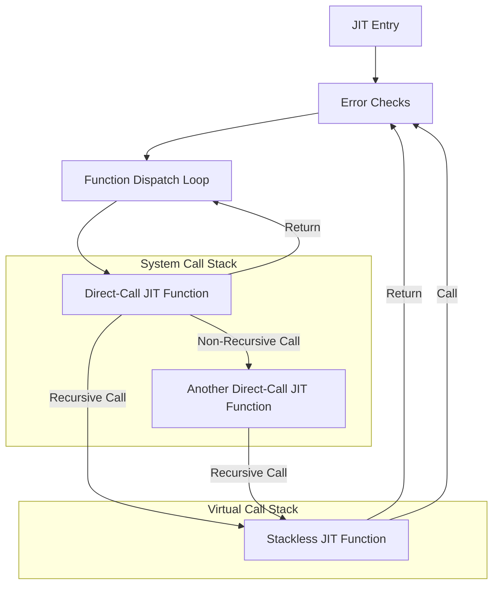

# The Design of Dust

## Virtual Machine

```mermaid
flowchart TD
    A[JIT Entry]
    B[Error Checks]
    C[Function Dispatch Loop]
    subgraph System Call Stack
    D[Direct-Call JIT Function]
    F[Another Direct-Call JIT Function]
    end
    subgraph Virtual Call Stack
    E[Stackless JIT Function]
    end
    A --> B
    B --> C
    C --> D
    D --> |Return|C
    D --> |Recursive Call|E
    D --> |Non-Recursive Call|F
    E --> |Return|B
    E --> |Call| B
    F --> |Recursive Call|E
```
