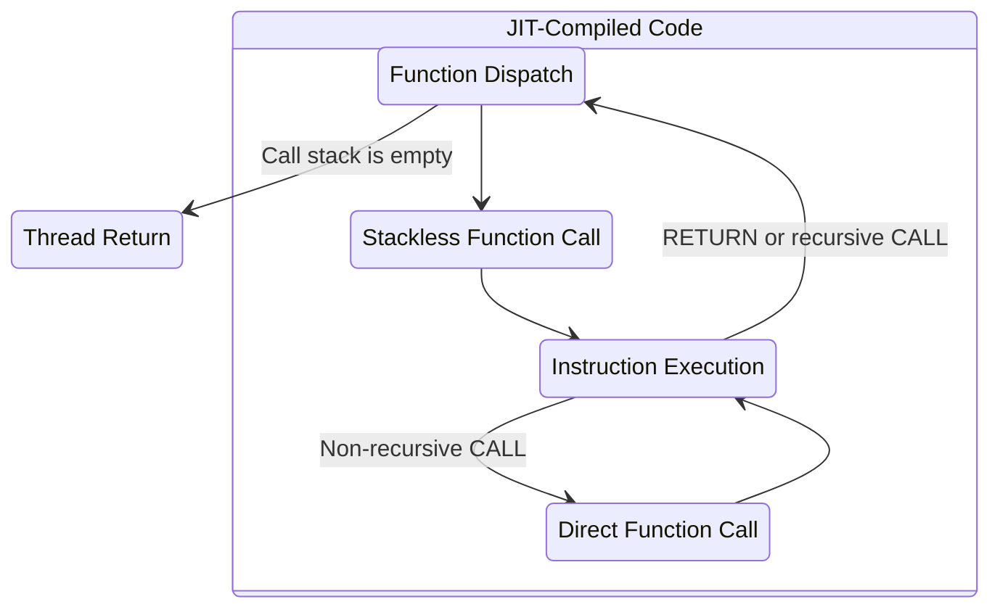

# The Design of Dust

> [!IMPORTANT]
>
> This document is a work in progress.

Dust is a personal project whose aspiration has grown from learning about programming language design to delivering a new language with a unique set of features. This document outlines those features and the designs that were chosen to achieve them. It covers the parsing and compilation strategy, the intermediate representation, the instruction set and the virtual machine architecture.

## Features

- **Simple syntax**: Dust is a C-like language. Its syntax is essentially identical to imperative Rust (i.e. the Rust code one finds inside of a function), which bears a strong resemblance to JavaScript and many others.
- **Helpful compiler**: Taking inspiration from Rust, the compiler should be specific in its error messages and, whenever possible, provide possible solutions. Dust uses the same library[^1] as the Rust compiler to emit error messages that highlight the problematic source code.
- **Competitive performance**: As an interpreted language, Dust should be competitive with other interpreted languages. Its speed and memory usage have been measured during development to inform
both the design and implementation of the language.

## Design Principles

### Lexing

Dust's entire process of lexing and parsing is zero-copy. This starts at the lexer and its tokens, which are are accompanied by the exact byte range they cover. This forms the basis for compile-time errors that can point to the exact location of a problem in the source code.

### Parsing

### Compilation

## Dust's Intermediate Representation

## Instruction Set

Most of the available literature on writing programming languages focuses on stack-based virtual machines, but Dust is a register-based language. There is an excellent guide[^2] to the Lua instruction set that was used as a reference for Dust's. However, as Dust has evolved, its instruction set has diverged from Lua's, mosty notably by using 64 bits instead of 32 and encoding more information on the operands, such as whether they are constants or registers as well as their type.

Dust was not originally designed with JIT compilation in mind, but the instruction set was already suited to mapping one instruction to one block of machine code. After JIT compilation became a primary goal, some changes were made to both the instruction set and the Chunk to support optimal JIT compiler output.

In a register-based language like Dust, values are loaded into registers and then the register's index is used as an operand in instructions. But this can conflict with JIT compilation. Dealing with constants is a clear example: the JIT compiler can make them literal machine code constants, so they don't need to be loaded into a register. To serve the JIT compiler without compromise and still leave room for an efficient bytecode-based VM, Dust's instructions encode a complete address for each operand so there is no need to load constants unless they are assigned to a variable, otherwise the constant can be accessed by its address.

There is a single instruction that can take an arbitrary number of operands: the `CALL` instruction. This presents a problem because the instruction can only account for three operand addresses. Other register-based languages may use registers more freely and load each argument into a register in a consecutive range, then use the instruction operands to encode the range of registers. Again, this would be wasteful in the JIT VM where constants can be placed directly into machine code instructions. Instead of reloading every operand, including constants, into registers, the `CALL` instruction encodes an index for a list of operands that are kept on the Chunk. This means that every function call has to look up its list of arguments. This is a clear win for the JIT compiler, which does this exactly once and then runs without needing to look up the arguments again. The bytecode VM has to look up the arguments every time it executes the `CALL` instruction, but there is also no need to load the arguments into registers, which saves memory and time.

### Instruction Layout

Bits  | Description
----- | -----------
0-4   | Operation
5-6   | Memory kind (for the A field)
7-8   | Memory kind (for the B field)
9-10  | Memory kind (for the C field)
11-15 | Operand type info
16-31 | A field (unsigned 16-bit integer), usually the destination index
32-47 | B field (unsigned 16-bit integer), usually an operand index
48-63 | C field (unsigned 16-bit integer), usually an operand index

## JIT Virtual Machine

[^1]: [annotate-snippets](https://crates.io/crates/annotate-snippets)
[^2]: [A No-Frills Introduction to Lua 5.1 VM Instructions](https://www.mcours.net/cours/pdf/hasclic3/hasssclic818.pdf)
