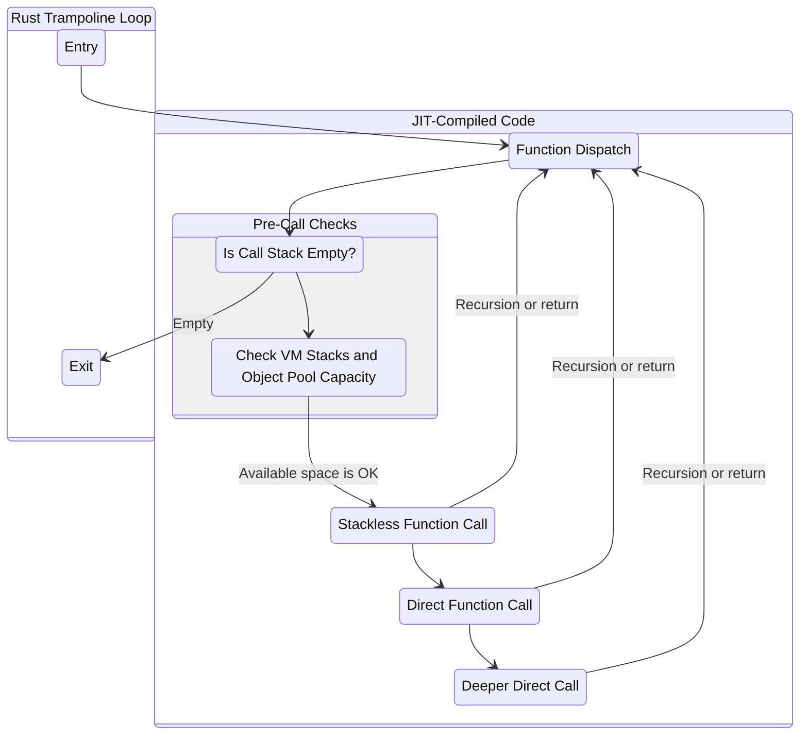

# The Design of Dust

> [!IMPORTANT]
>
> This document is a work in progress.

Dust is a personal project whose aspiration has grown from learning about programming language design to delivering a new language with a unique set of features. This document outlines those features as well as the design principles and implementation details of Dust. It covers the parsing and compilation strategy, the instruction set, the intermediate representation and the virtual machine architecture.

## Features

- **Simple syntax**: The language syntax itself must be simple and reasonably similar to existing languages. Dust is a C-like language. Its syntax is essentially identical to imperative Rust (i.e. the Rust code one finds inside of a function), which bears a strong resemblance to JavaScript and many others.
- **Helpful compiler**: Taking inspiration from Rust, the compiler should be specific in its error messages and, whenever possible, provide possible solutions. Dust uses the same library[^1] as the Rust compiler to emit error messages that reference specific lines and columns in the source code.
- **Competitive performance**: As an interpreted language, Dust should be competitive with other interpreted languages. Its speed and memory usage has been measured during development to inform
both the design and implementation of the language.

## Design Principles

## Parsing and Compilation

### Lexing

### Parsing

### Instruction Emission

## Instruction Set

## Dust's Intermediate Representation

## JIT Virtual Machine

[^1]: [annotate-snippets](https://crates.io/crates/annotate-snippets)
